<p align="center">
  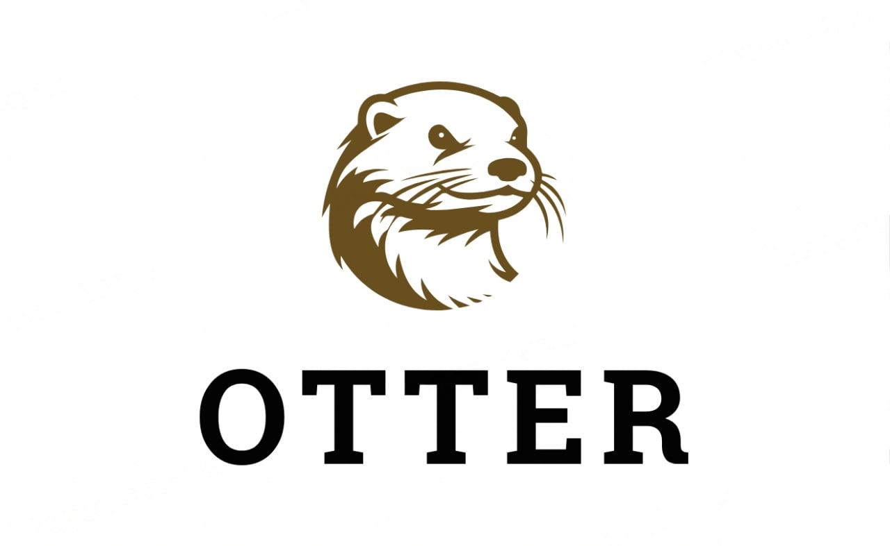
  <h2 align="center">High performance in-memory cache</h2>
</p>

<p align="center">
<a href="https://pkg.go.dev/github.com/maypok86/otter"></a>

<a href="https://codecov.io/gh/maypok86/otter" >
    
</a>

<a href="https://github.com/avelino/awesome-go"></a>
</p>

## 📖 Contents

- [Motivation](#motivation)
- [Related works](#related-works)
- [Features](#features)
- [Usage](#usage)
  - [Requirements](#requirements)
  - [Installation](#installation)
  - [Examples](#examples)
- [Performance](#performance)
  - [Throughput](#throughput)
  - [Hit ratio](#hit-ratio)
- [Contribute](#contribute)
- [License](#license)

## 💡 Motivation <a id="motivation" />

I once came across the fact that none of the Go cache libraries are truly contention-free. Most of them are a map with a mutex and an eviction policy. Unfortunately, these are not able to reach the speed of caches in other languages (such as [Caffeine](https://github.com/ben-manes/caffeine)). For example, the fastest cache from Dgraph labs called [Ristretto](https://github.com/dgraph-io/ristretto), was faster than competitors by 30% at best (Otter is many times faster) but had [poor hit ratio](https://github.com/dgraph-io/ristretto/issues/336), even though its README says otherwise. This can be a problem in real-world applications, because no one wants to bump into performance of a cache library 🙂. As a result, I wanted to make the fastest, easiest-to-use cache with excellent hit ratio.

**Please leave a ⭐ as motivation if you liked the idea 😄**

## 🗃 Related works <a id="related-works" />

Otter is based on the following papers

- [BP-Wrapper: A Framework Making Any Replacement Algorithms (Almost) Lock Contention Free](https://www.researchgate.net/publication/220966845_BP-Wrapper_A_System_Framework_Making_Any_Replacement_Algorithms_Almost_Lock_Contention_Free)
- [FIFO queues are all you need for cache eviction](https://dl.acm.org/doi/10.1145/3600006.3613147)
- [Bucket-Based Expiration Algorithm: Improving Eviction Efficiency for In-Memory Key-Value Database](https://dl.acm.org/doi/fullHtml/10.1145/3422575.3422797)
- [A large scale analysis of hundreds of in-memory cache clusters at Twitter](https://www.usenix.org/system/files/osdi20-yang.pdf)

## ✨ Features <a id="features" />

- **Simple API**: Just set the parameters you want in the builder and enjoy
- **Autoconfiguration**: Otter is automatically configured based on the parallelism of your application
- **Generics**: You can safely use any comparable types as keys and any types as values
- **TTL**: Expired values will be automatically deleted from the cache
- **Cost-based eviction**: Otter supports eviction based on the cost of each item
- **Excellent throughput**: Otter is currently the fastest cache library with a huge lead over the [competition](#throughput)
- **Great hit ratio**: New S3-FIFO algorithm is used, which shows excellent [results](#hit-ratio)

## 📚 Usage <a id="usage" />

### 📋 Requirements <a id="requirements" />

- Go 1.19+

### 🛠️ Installation <a id="installation" />

```shell
go get -u github.com/maypok86/otter
```

### ✏️ Examples <a id="examples" />

Otter uses a builder pattern that allows you to conveniently create a cache instance with different parameters.

**Cache with const TTL**
```go
package main

import (
    "fmt"
    "time"

    "github.com/maypok86/otter"
)

func main() {
    // create a cache with capacity equal to 10000 elements
    cache, err := otter.MustBuilder[string, string](10_000).
        CollectStats().
        Cost(func(key string, value string) uint32 {
            return 1
        }).
        WithTTL(time.Hour).
        Build()
    if err != nil {
        panic(err)
    }

    // set item with ttl (1 hour) 
    cache.Set("key", "value")

    // get value from cache
    value, ok := cache.Get("key")
    if !ok {
        panic("not found key")
    }
    fmt.Println(value)

    // delete item from cache
    cache.Delete("key")

    // delete data and stop goroutines
    cache.Close()
}
```

**Cache with variable TTL**
```go
package main

import (
    "fmt"
    "time"

    "github.com/maypok86/otter"
)

func main() {
    // create a cache with capacity equal to 10000 elements
    cache, err := otter.MustBuilder[string, string](10_000).
        CollectStats().
        Cost(func(key string, value string) uint32 {
            return 1
        }).
        WithVariableTTL().
        Build()
    if err != nil {
        panic(err)
    }

    // set item with ttl (1 hour)
    cache.Set("key1", "value1", time.Hour)
    // set item with ttl (1 minute)
    cache.Set("key2", "value2", time.Minute)

    // get value from cache
    value, ok := cache.Get("key1")
    if !ok {
        panic("not found key")
    }
    fmt.Println(value)

    // delete item from cache
    cache.Delete("key1")

    // delete data and stop goroutines
    cache.Close()
}
```

## 📊 Performance <a id="performance" />

The benchmark code can be found [here](https://github.com/maypok86/benchmarks).

### 🚀 Throughput <a id="throughput" />

Throughput benchmarks are a Go port of the caffeine [benchmarks](https://github.com/ben-manes/caffeine/blob/master/caffeine/src/jmh/java/com/github/benmanes/caffeine/cache/GetPutBenchmark.java).

#### Read (100%)

In this [benchmark](https://github.com/maypok86/benchmarks/blob/main/throughput/bench_test.go) **8 threads** concurrently read from a cache configured with a maximum size.

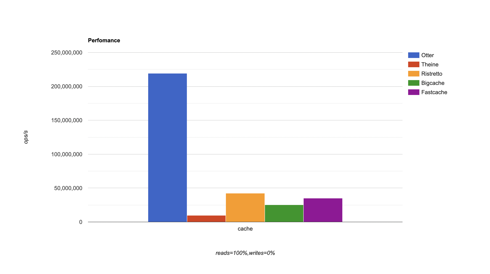

#### Read (75%) / Write (25%)

In this [benchmark](https://github.com/maypok86/benchmarks/blob/main/throughput/bench_test.go) **6 threads** concurrently read from and **2 threads** write to a cache configured with a maximum size.

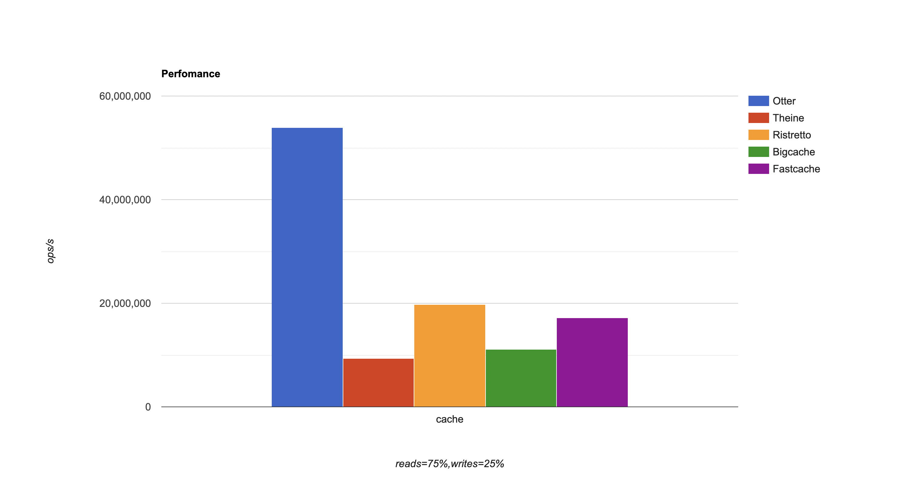

#### Read (50%) / Write (50%)

In this [benchmark](https://github.com/maypok86/benchmarks/blob/main/throughput/bench_test.go) **4 threads** concurrently read from and **4 threads** write to a cache configured with a maximum size.

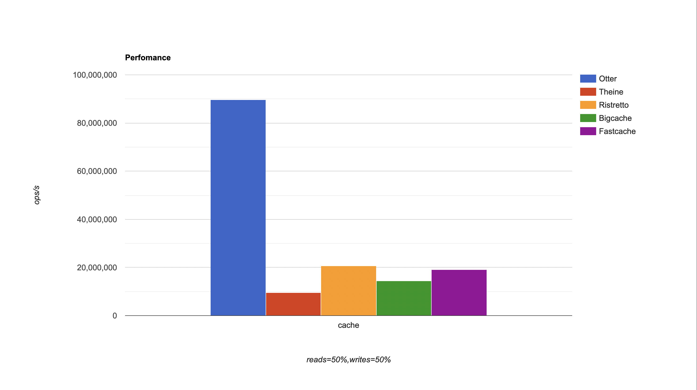

#### Read (25%) / Write (75%)

In this [benchmark](https://github.com/maypok86/benchmarks/blob/main/throughput/bench_test.go) **2 threads** concurrently read from and **6 threads** write to a cache configured with a maximum size.

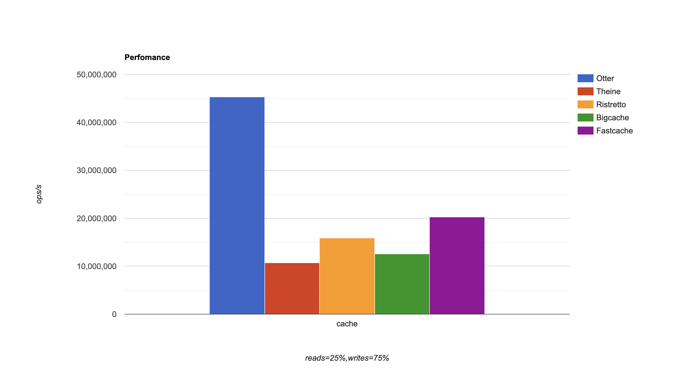

#### Write (100%)

In this [benchmark](https://github.com/maypok86/benchmarks/blob/main/throughput/bench_test.go) **8 threads** concurrently write to a cache configured with a maximum size.

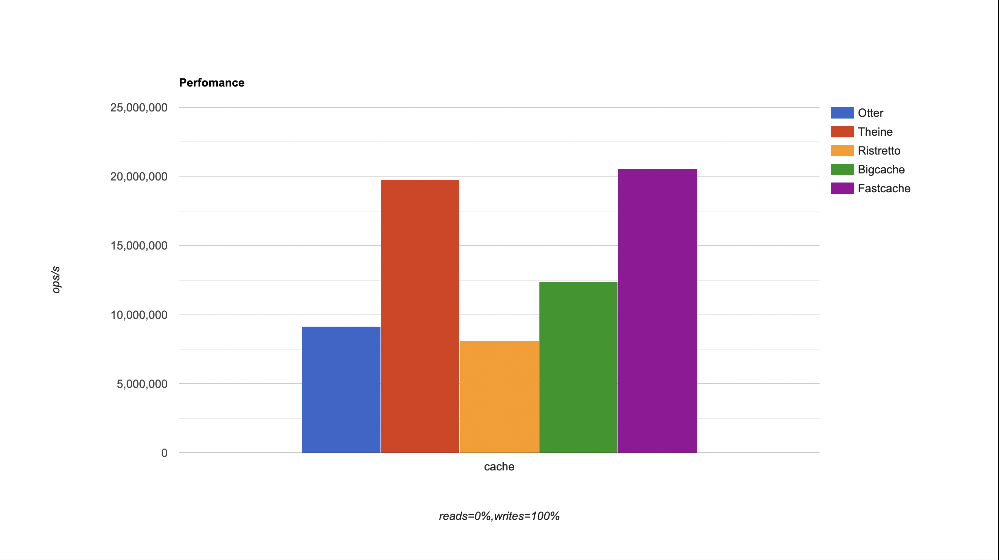

Otter shows fantastic speed under all workloads except extreme write-heavy, but such a workload is very rare for caches and usually indicates that the cache has a very small hit ratio.

### 🎯 Hit ratio <a id="hit-ratio" />

#### Zipf

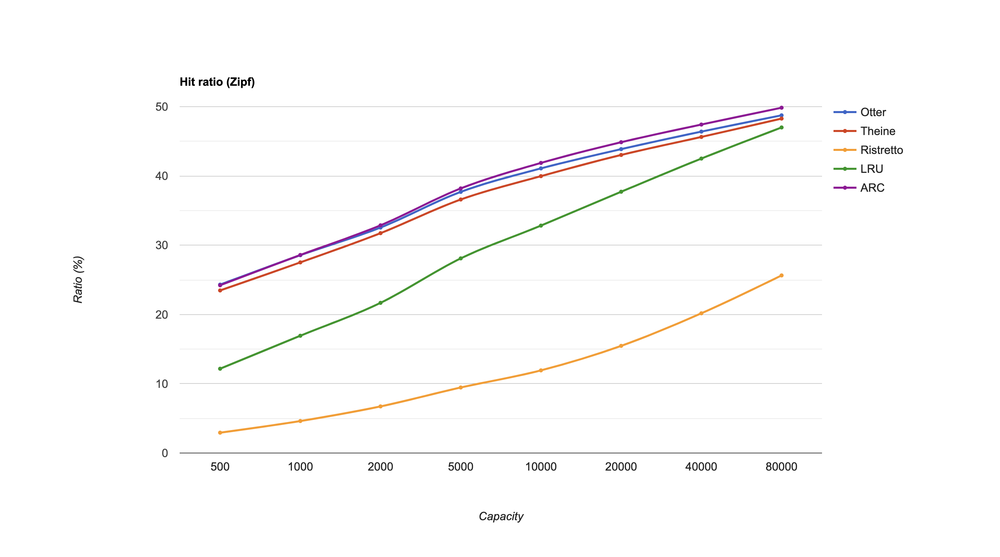

#### S3

This trace is described as "disk read accesses initiated by a large commercial search engine in response to various web search requests."

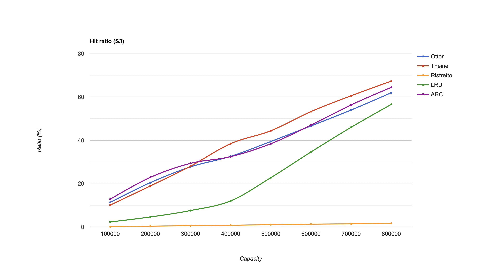

#### DS1

This trace is described as "a database server running at a commercial site running an ERP application on top of a commercial database."

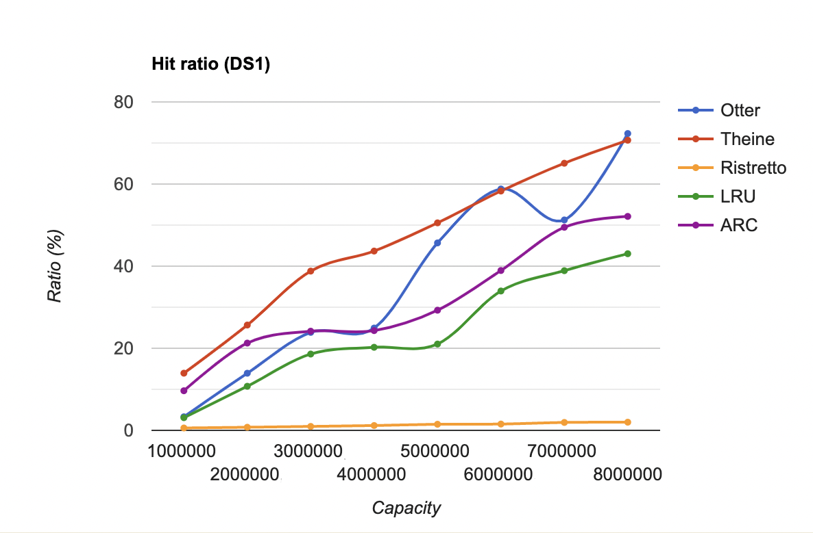

#### P3

The trace P3 was collected from workstations running Windows NT by using Vtrace
which captures disk operations through the use of device
filters

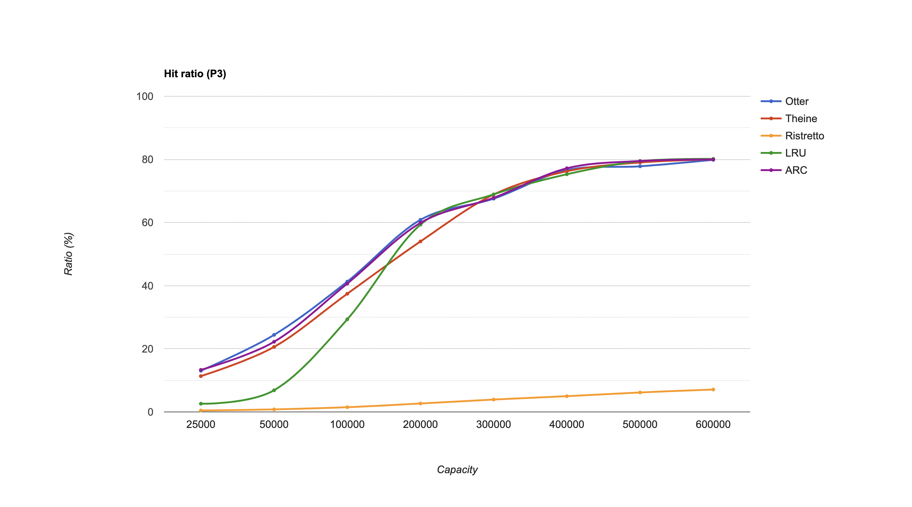

#### P8

The trace P8 was collected from workstations running Windows NT by using Vtrace
which captures disk operations through the use of device
filters

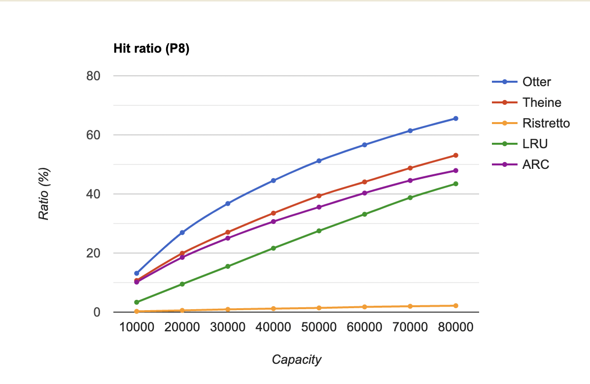

#### LOOP

This trace demonstrates a looping access pattern.

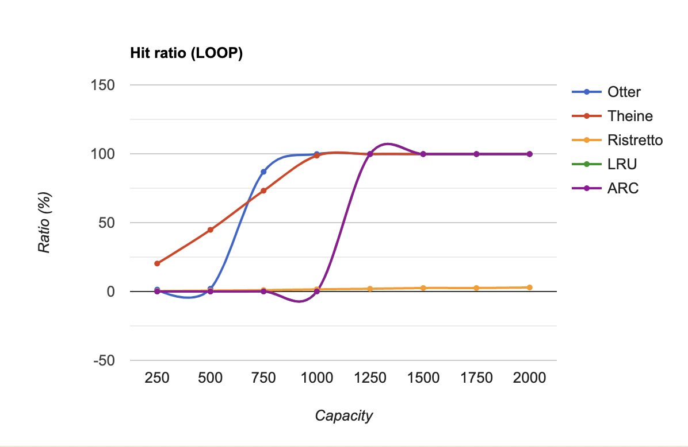

#### OLTP

This trace is described as "references to a CODASYL database for a one hour period."

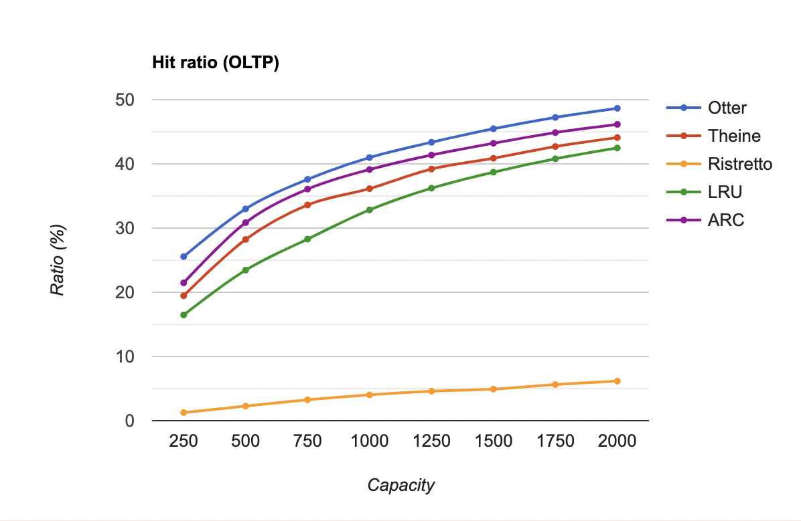

In summary, we have that S3-FIFO (otter) is inferior to W-TinyLFU (theine) on lfu friendly traces (databases, search, analytics), but has a greater or equal hit ratio on web traces.

## 👏 Contribute <a id="contribute" />

Contributions are welcome as always, before submitting a new PR please make sure to open a new issue so community members can discuss it.
For more information please see [contribution guidelines](./CONTRIBUTING.md).

Additionally, you might find existing open issues which can help with improvements.

This project follows a standard [code of conduct](./CODE_OF_CONDUCT.md) so that you can understand what actions will and will not be tolerated.

## 📄 License <a id="license" />

This project is Apache 2.0 licensed, as found in the [LICENSE](./LICENSE).
