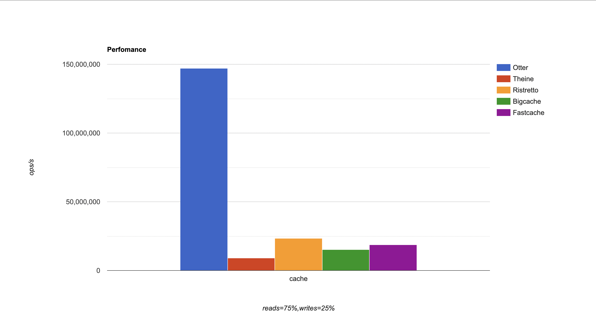

<p align="center">
  
  <h2 align="center">High performance in-memory cache</h2>
</p>

<p align="center">

<a href="https://codecov.io/gh/maypok86/otter" >
    
</a>


<br />

## 📖 Contents

- [Motivation](#motivation)
- [Related works](#related-works)
- [Features](#features)
- [Usage](#usage)
  - [Requirements](#requirements)
  - [Installation](#installation)
  - [Examples](#examples)
- [Benchmarks](#benchmarks)
  - [Performance](#performance)
  - [Hit ratio](#hit-ratio)
- [Contribute](#contribute)
- [License](#license)

## 💡 Motivation <a id="motivation" />

I once came across the fact that none of the Golang cache libraries are truly contention-free. All of them are just a standard map with mutex and some eviction policy. Unfortunately, these are not able to reach the speed of caches in other languages (such as [Caffeine](https://github.com/ben-manes/caffeine)). For example, the fastest cache from Dgraph labs called [Ristretto](https://github.com/dgraph-io/ristretto), which was faster than competitors by 30% at best (Otter is many times faster) and had a [disgusting hit ratio](https://github.com/dgraph-io/ristretto/issues/336) even though README says otherwise. This can be a problem in different applications because no one wants to bump the performance of a cache library and its bad hit ratio 🙂. As a result, I wanted to get the fastest, easiest-to-use cache with excellent hit ratio and support from the authors and Otter is designed to correct this unfortunate misunderstanding.

**Please leave a ⭐ as motivation if you liked the idea 😄**

## 🗃 Related works <a id="related-works" />
Otter is based on the following papers:
- [BP-Wrapper: A Framework Making Any Replacement Algorithms (Almost) Lock Contention Free](http://web.cse.ohio-state.edu/hpcs/WWW/HTML/publications/papers/TR-09-1.pdf)
- [FIFO queues are all you need for cache eviction](https://dl.acm.org/doi/10.1145/3600006.3613147)
- [Bucket-Based Expiration Algorithm: Improving Eviction Efficiency for In-Memory Key-Value Database](https://dl.acm.org/doi/fullHtml/10.1145/3422575.3422797)
- [A large scale analysis of hundreds of in-memory cache clusters at Twitter](https://www.usenix.org/system/files/osdi20-yang.pdf)

## ✨ Features <a id="features" />

This library has lots of features such as:
- **Simple API**: Just set the parameters you want in the builder and enjoy
- **Autoconfiguration**: Otter is automatically configured based on the parallelism of your application
- **Generics**: You can safely use any comparable types as keys and any types as values
- **TTL**: Expired values will be automatically deleted from the cache
- **Cost-based eviction**: Otter supports eviction based on the cost of each item
- **Excellent performance**: Otter is currently the fastest cache library with a huge lead over the [competition](#performance)
- **Great hit ratio**: New S3-FIFO algorithm is used, which shows excellent [results](#hit-ratio)

## 📚 Usage <a id="usage" />

### 📋 Requirements <a id="requirements" />

- Go 1.18+

### 🛠️ Installation <a id="installation" />

```shell
go get -u github.com/maypok86/otter
```

### ✏️ Examples <a id="examples" />

**Builder**

Otter uses a builder pattern that allows you to conveniently create a cache object with different parameters

```go
package main

import (
  "github.com/maypok86/otter"
)

func main() {
  // NewBuilder creates a builder and sets the future cache capacity to 1000 elements.
  // Returns an error if capacity <= 0.
  builder, err := otter.NewBuilder[string, string](1000)
  if err != nil {
    panic(err)
  }

  // StatsEnabled determines whether statistics should be calculated when the cache is running.
  // By default, statistics calculating is disabled.
  builder.StatsEnabled(true)

  // Cost sets a function to dynamically calculate the weight of a key-value pair.
  // By default this function always returns 1.
  builder.Cost(func(key string, value string) uint32 {
    return uint32(len(value))
  })

  // Build creates a new cache object or
  // returns an error if invalid parameters were passed to the builder.
  cache, err := builder.Build()
  if err != nil {
    panic(err)
  }

  cache.Close()
}
```

**Cache**
```go
package main

import (
  "fmt"
  "time"

  "github.com/maypok86/otter"
)

func main() {
  // create a cache with capacity equal to 10000 elements
  cache, err := otter.MustBuilder[string, string](10_000).Build()
  if err != nil {
    panic(err)
  }

  // set key-value pair with ttl (1 hour) 
  cache.SetWithTTL("key", "value", time.Hour)

  // get value from cache
  value, ok := cache.Get("key")
  if !ok {
    panic("not found key")
  }
  fmt.Println(value)

  // delete key-value pair from cache
  cache.Delete("key")

  // delete data and stop goroutines
  cache.Close()
}
```

## 📊 Benchmarks <a id="benchmarks" />

The benchmark code can be found [here](https://github.com/maypok86/benchmarks)

### 🚀 Performance <a id="performance" />

Throughput benchmarks are a port of the caffeine [benchmarks](https://github.com/ben-manes/caffeine/blob/master/caffeine/src/jmh/java/com/github/benmanes/caffeine/cache/GetPutBenchmark.java) in Golang.

#### Read (100%)

In this [benchmark](https://github.com/maypok86/benchmarks/blob/main/perf/bench_test.go) **8 threads** concurrently read from a cache configured with a maximum size.


#### Read (75%) / Write (25%)

In this [benchmark](https://github.com/maypok86/benchmarks/blob/main/perf/bench_test.go) **6 threads** concurrently read from and **2 threads** write to a cache configured with a maximum size.



#### Read (50%) / Write (50%)

In this [benchmark](https://github.com/maypok86/benchmarks/blob/main/perf/bench_test.go) **4 threads** concurrently read from and **4 threads** write to a cache configured with a maximum size.


#### Read (25%) / Write (75%)

In this [benchmark](https://github.com/maypok86/benchmarks/blob/main/perf/bench_test.go) **2 threads** concurrently read from and **6 threads** write to a cache configured with a maximum size.


#### Write (100%)

In this [benchmark](https://github.com/maypok86/benchmarks/blob/main/perf/bench_test.go) **8 threads** concurrently write to a cache configured with a maximum size.


Otter shows fantastic speed under all loads except extreme write-heavy, but such a load is very rare for caches and usually indicates that the cache has a very small hit ratio.

### 🎯 Hit ratio <a id="hit-ratio" />

#### Zipf


#### S3

This trace is described as "disk read accesses initiated by a large commercial search engine in response to various web search requests."


#### DS1

This trace is described as "a database server running at a commercial site running an ERP application on top of a commercial database."


#### P3

The trace P3 was collected from workstations running Windows NT by using Vtrace
which captures disk operations through the use of device
filters


#### P8

The trace P8 was collected from workstations running Windows NT by using Vtrace
which captures disk operations through the use of device
filters


#### LOOP

This trace demonstrates a looping access pattern.


#### OLTP

This trace is described as "references to a CODASYL database for a one hour period."


In summary, we have that S3-FIFO (otter) is inferior to W-TinyLFU (theine) on lfu friendly traces (databases, search, analytics), but has a greater or equal hit ratio on web traces.

## 👏 Contribute <a id="contribute" />

Contributions are welcome as always, before submitting a new PR please make sure to open a new issue so community members can discuss it.
For more information please see [contribution guidelines](./CONTRIBUTING.md).

Additionally, you might find existing open issues which can help with improvements.

This project follows a standard [code of conduct](./CODE_OF_CONDUCT.md) so that you can understand what actions will and will not be tolerated.

## 📄 License <a id="license" />

This project is Apache 2.0 licensed, as found in the [LICENSE](./LICENSE).