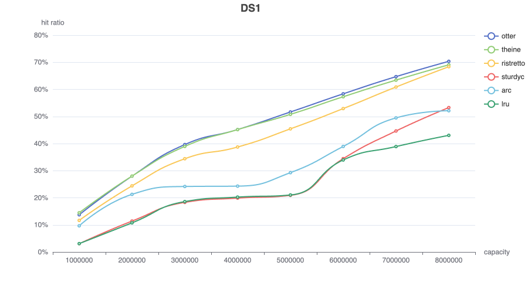
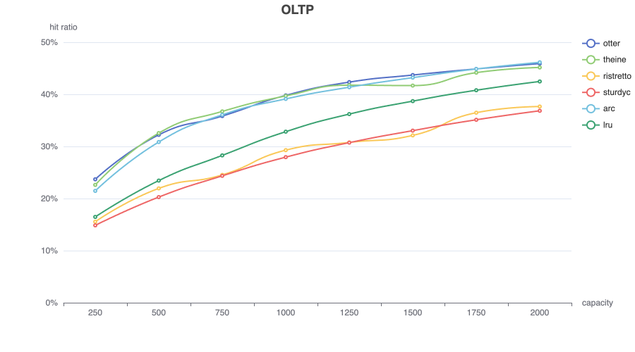
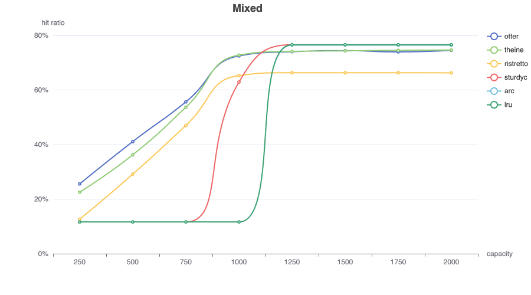

# Hit ratio

The hit rate simulation code is available [here](https://github.com/maypok86/otter/tree/main/benchmarks/simulator).

## Traditional traces

### Zipf

### S3

This trace is described as "disk read accesses initiated by a large commercial search engine in response to various web search requests.".

### DS1

This trace is described as "a database server running at a commercial site running an ERP application on top of a commercial database.".

### P8

The trace P8 was collected from workstations running Windows NT by using Vtrace
which captures disk operations through the use of device
filters.

### Glimpse

This trace exhibits a looping access pattern.

### OLTP

This trace is described as "references to a CODASYL database for a one-hour period.".

### Scarab

Scarab Research 1 hour database trace. Frequency is a negative signal in this workload.

### Mixed

This workload shifts between a recency-skewed trace (Corda) and a frequency-skewed trace (Lirs' LOOP).

## Conclusion

Otter's `W-TinyLFU` provides a top-tier hit rate in all workloads. It does so while remaining simple, does not require non-resident entries, and has a low memory footprint. The policy provides a substantial improvement to `LRU` across a variety of workloads, making it a good choice for a general purpose cache.

Both Otter's and Theine's W-TinyLFU implementations demonstrate nearly identical hit rates across most workloads. However, on the Glimpse trace, Theine exhibits unexpected hit rate fluctuations while Otter maintains stable performance.

Ristretto demonstrates solid performance on frequency-biased workloads (e.g., database page caches, search, and analytics). However, it may face challenges with recency-biased workloads (message brokers, financial applications, etc.).

Sturdyc showed limited effectiveness in these tests, regularly trailing behind basic LRU's hit rate performance.
