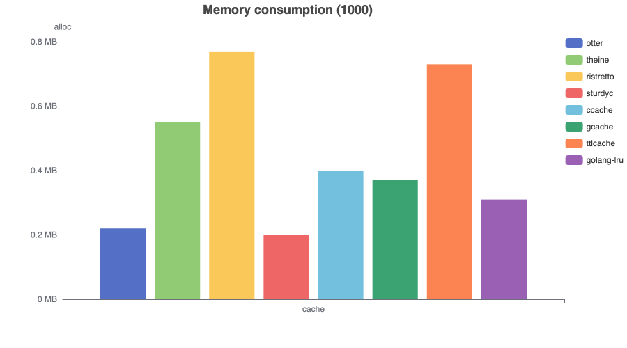
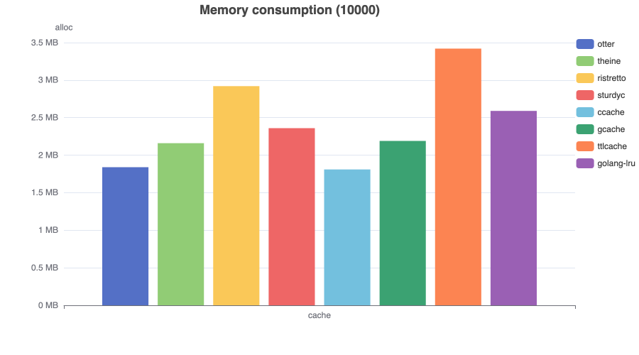
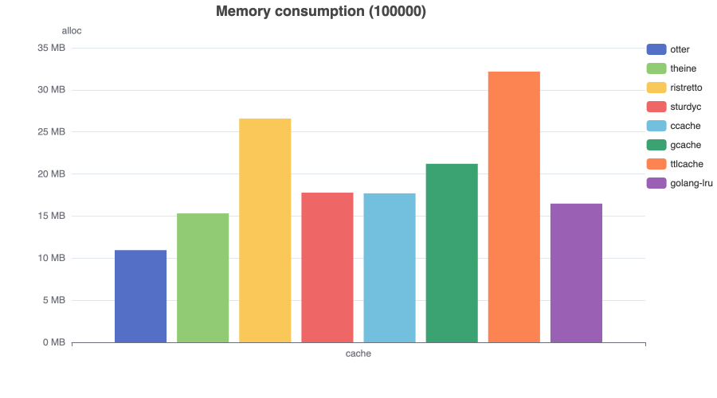

# Memory consumption

### Description

These benchmarks utilize pre-generated 32-byte key-value pairs (fixed-size strings). All implementations were tested with expiration policies enabled to measure memory overhead - representing the most common cache usage pattern.

The source code can be found [here](https://github.com/maypok86/otter/tree/main/benchmarks/memory).

### Capacity (1000)

This benchmark measures memory overhead for a cache with a fixed capacity of 1,000 entries.

### Capacity (10000)

This benchmark measures memory overhead for a cache with a fixed capacity of 10,000 entries.

### Capacity (25000)

This benchmark measures memory overhead for a cache with a fixed capacity of 25,000 entries.

### Capacity (100000)

This benchmark measures memory overhead for a cache with a fixed capacity of 100,000 entries.

### Capacity (1000000)

This benchmark measures memory overhead for a cache with a fixed capacity of 1,000,000 entries.

### Conclusion

Otter maintains low memory overhead across all capacity levels - a notable achievement considering its additional read/write buffer implementation.

Note that Ristretto typically consumes less memory than competing cache implementations. This optimization comes with a significant tradeoff - the library employs an unconventional approach where it stores only dual hash values instead of actual keys.
