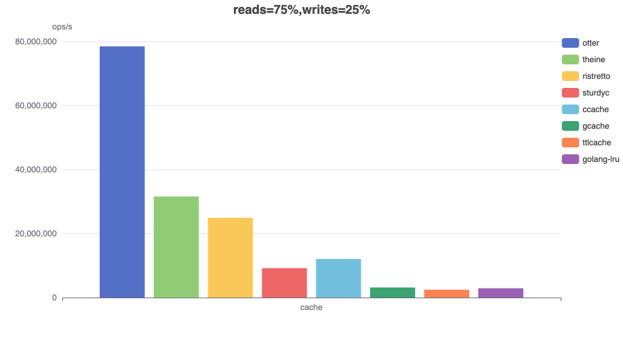
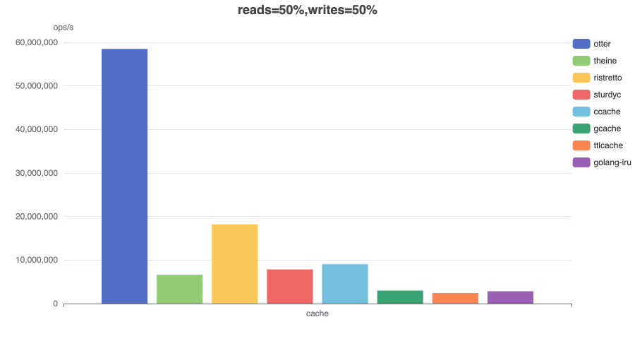
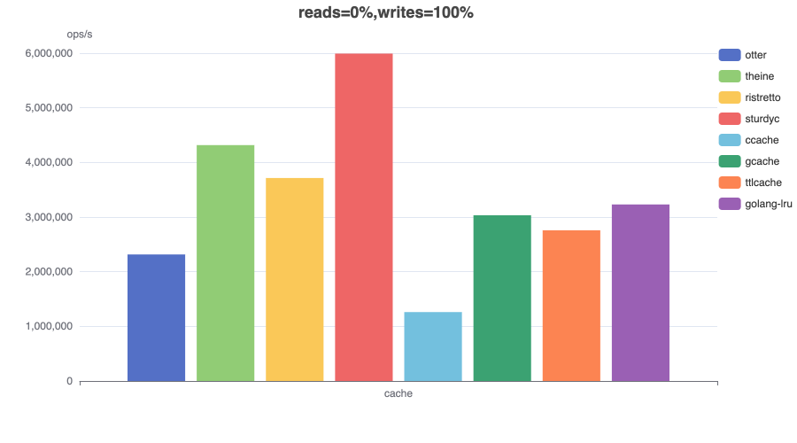

# Throughput

Throughput benchmarks are a Go port of the Caffeine [benchmarks](https://github.com/ben-manes/caffeine/blob/master/caffeine/src/jmh/java/com/github/benmanes/caffeine/cache/GetPutBenchmark.java).

### Description

The [benchmark](https://github.com/maypok86/benchmarks/blob/main/throughput/bench_test.go) that I use has a pre-populated cache with a zipf distribution for the access requests. That creates hot spots as some entries are used much more often than others, just like a real cache would experience. A common mistake is a uniform policy (distribution consisting of unique elements) which evenly spreads the contention, which would imply random replacement is the ideal policy. A skewed distribution means that locks suffer higher contention so it exacerbates that as a problems, while also benefiting contention-free implementations who can better utilize the cpu cache.

The benchmark's overhead is thread-local work for an index increment, array lookup, loop, and operation counter. If we introduce a cost like data dependencies (such as by using a random number generator to select the next key), we'd see this fall sharply as we no longer allow the CPU/compiler to use the hardware's full potential.

Also in benchmarks, the cache initially fully populated because a cache miss always takes much less time than a hit, since you don't need to update the eviction policy. Because of this, implementations with a small hit ratio get a huge advantage and as a result it is easy to misinterpret the results of such benchmarks.

In the end, I think this is one of the best benchmarks to compare cache speeds because this micro-benchmark tries to isolate the costs to only measuring the cache in a concurrent workload. It would show bottlenecks such as due to hardware cache coherence, data dependencies, poor branch prediction, saturation of the logic units (there are multiple ALUs for every FP unit), (lack of) SIMD, waits on the store buffer, blocking and context switches, system calls, inefficient algorithms, etc.

### Read (100%)

In this [benchmark](https://github.com/maypok86/otter/blob/main/benchmarks/throughput/bench_test.go) **8 threads** concurrently read from a cache configured with a maximum size.


### Read (75%) / Write (25%)

In this [benchmark](https://github.com/maypok86/otter/blob/main/benchmarks/throughput/bench_test.go) **6 threads** concurrently read from and **2 threads** write to a cache configured with a maximum size.



### Read (50%) / Write (50%)

In this [benchmark](https://github.com/maypok86/otter/blob/main/benchmarks/throughput/bench_test.go) **4 threads** concurrently read from and **4 threads** write to a cache configured with a maximum size.



### Read (25%) / Write (75%)

In this [benchmark](https://github.com/maypok86/otter/blob/main/benchmarks/throughput/bench_test.go) **2 threads** concurrently read from and **6 threads** write to a cache configured with a maximum size.


### Write (100%)

In this [benchmark](https://github.com/maypok86/otter/blob/main/benchmarks/throughput/bench_test.go) **8 threads** concurrently write to a cache configured with a maximum size.



### Conclusion

Otter maintains excellent throughput under high contention across all workload types, except extreme write-heavy (update-heavy) scenarios. However, such workloads are uncommon for caches, as they typically indicate an inherently low hit rate and usually cache misses are inserts, not updates.

## Eviction

A [benchmark](https://github.com/maypok86/otter/blob/main/benchmarks/eviction/bench_test.go) that evaluates the eviction performance of a cache. The cache is prepopulated for a 100% eviction rate to mimic worst-case behavior (100% inserts). This benchmark should not be used to compare cache speeds, but it may reveal some interesting issues.

capacity=100
```
goos: darwin
goarch: arm64
pkg: github.com/maypok86/otter/v2/benchmarks/eviction
cpu: Apple M1 Pro
BenchmarkCache
BenchmarkCache/otter_capacity=100
BenchmarkCache/otter_capacity=100-10         	 3898776	       307.5 ns/op	   3251920 ops/s	      41 B/op	       1 allocs/op
BenchmarkCache/theine_capacity=100
BenchmarkCache/theine_capacity=100-10        	 2690583	       425.9 ns/op	   2348010 ops/s	      80 B/op	       1 allocs/op
BenchmarkCache/ristretto_capacity=100
BenchmarkCache/ristretto_capacity=100-10     	27816357	        44.95 ns/op	  22246427 ops/s	      68 B/op	       1 allocs/op
BenchmarkCache/golang-lru_capacity=100
BenchmarkCache/golang-lru_capacity=100-10    	 4476072	       266.6 ns/op	   3750443 ops/s	      64 B/op	       1 allocs/op
BenchmarkCache/gcache_capacity=100
BenchmarkCache/gcache_capacity=100-10        	 3380430	       376.6 ns/op	   2655666 ops/s	     120 B/op	       3 allocs/op
BenchmarkCache/ttlcache_capacity=100
BenchmarkCache/ttlcache_capacity=100-10      	 4002375	       290.8 ns/op	   3438486 ops/s	     128 B/op	       2 allocs/op
```

capacity=10000
```
goos: darwin
goarch: arm64
pkg: github.com/maypok86/otter/v2/benchmarks/eviction
cpu: Apple M1 Pro
BenchmarkCache
BenchmarkCache/otter_capacity=10000
BenchmarkCache/otter_capacity=10000-10         	 3020878	       342.2 ns/op	   2922559 ops/s	      41 B/op	       1 allocs/op
BenchmarkCache/theine_capacity=10000
BenchmarkCache/theine_capacity=10000-10        	 2648924	       465.2 ns/op	   2149415 ops/s	      80 B/op	       1 allocs/op
BenchmarkCache/ristretto_capacity=10000
BenchmarkCache/ristretto_capacity=10000-10     	25218223	        50.80 ns/op	  19686347 ops/s	      69 B/op	       1 allocs/op
BenchmarkCache/golang-lru_capacity=10000
BenchmarkCache/golang-lru_capacity=10000-10    	 2870298	       396.6 ns/op	   2521622 ops/s	      64 B/op	       1 allocs/op
BenchmarkCache/gcache_capacity=10000
BenchmarkCache/gcache_capacity=10000-10        	 3519871	       373.7 ns/op	   2675902 ops/s	     120 B/op	       3 allocs/op
BenchmarkCache/ttlcache_capacity=10000
BenchmarkCache/ttlcache_capacity=10000-10      	 3601334	       321.4 ns/op	   3111849 ops/s	     128 B/op	       2 allocs/op
PASS
```

capacity=1000000
```
goos: darwin
goarch: arm64
pkg: github.com/maypok86/otter/v2/benchmarks/eviction
cpu: Apple M1 Pro
BenchmarkCache
BenchmarkCache/otter_capacity=1000000
BenchmarkCache/otter_capacity=1000000-10         	 2432457	       417.0 ns/op	   2398029 ops/s	      32 B/op	       1 allocs/op
BenchmarkCache/theine_capacity=1000000
BenchmarkCache/theine_capacity=1000000-10        	 2130484	       578.4 ns/op	   1728787 ops/s	      80 B/op	       1 allocs/op
BenchmarkCache/ristretto_capacity=1000000
BenchmarkCache/ristretto_capacity=1000000-10     	16660399	        64.80 ns/op	  15431051 ops/s	      77 B/op	       1 allocs/op
BenchmarkCache/golang-lru_capacity=1000000
BenchmarkCache/golang-lru_capacity=1000000-10    	 2655174	       461.0 ns/op	   2169356 ops/s	      64 B/op	       1 allocs/op
BenchmarkCache/gcache_capacity=1000000
BenchmarkCache/gcache_capacity=1000000-10        	 2908304	       424.4 ns/op	   2356435 ops/s	     120 B/op	       3 allocs/op
BenchmarkCache/ttlcache_capacity=1000000
BenchmarkCache/ttlcache_capacity=1000000-10      	 2409374	       483.7 ns/op	   2067315 ops/s	     128 B/op	       2 allocs/op
PASS
```

### Conclusion

**Otter** demonstrated quite good performance, even though it inherently has a harder time handling a 100% insert workload compared to simple mutex-protected LRU caches (golang-lru, ttlcache, gcache). The reason is that Otter uses a more sophisticated eviction policy, which takes more time to make eviction decisions. Additionally, in this case, the write buffer doesn’t help much simply because we can’t gain time by delaying writes—each one is quickly followed by many others. Otter also allocates the least amount of memory.

**Theine** showed acceptable eviction speed since your system is unlikely to ever exceed 2 million misses per second.

**Ristretto** delivered fantastic speed, but unfortunately, this is achieved by dropping inserts due to contention.
Whether you need this feature is up to you. Just keep in mind that such drops can lead to a significant drop in hit rate under heavy load.

**Gcache, ttlcache, and golang-lru** were added as baseline comparisons against a simple mutex-protected map with LRU, so no further comments here.
